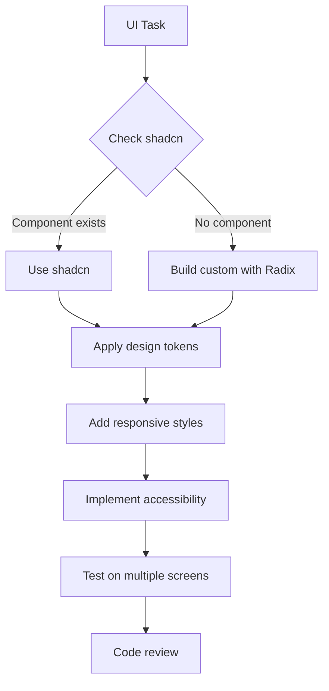
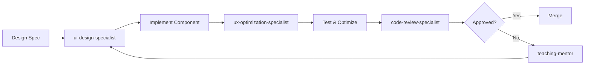
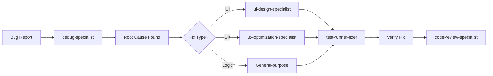
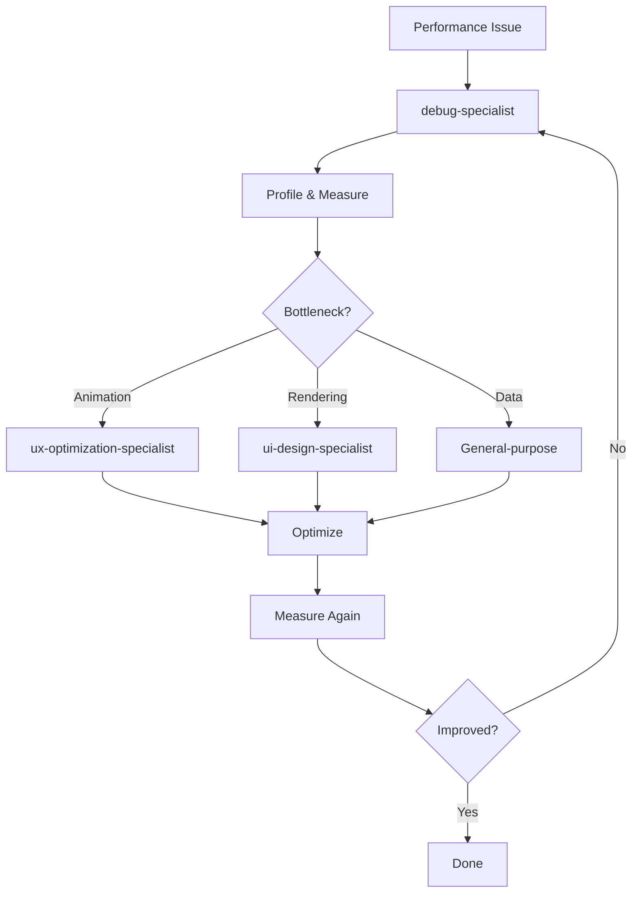

# PART 5: Agents Configuration

## Custom Agents Setup & Workflow Strategies

---

## 🤖 Existing Project Agents

### Located in: `/Users/art/code/git-user-info/.claude/agents`

---

### 1. **test-runner-fixer** (Sonnet)

**Role**: Run tests, fix failures, optimize test suite
**MCP**: Playwright

#### Usage

##### Run Unit Tests

```bash
# Run all Vitest tests
claude-code invoke test-runner-fixer "Run all unit tests and report failures"

# Specific test file
claude-code invoke test-runner-fixer "Run tests for CompactProjectRow component"

# Fix failing tests
claude-code invoke test-runner-fixer "Tests for Level 1 expansion are failing - investigate and fix"
```

##### Run E2E Tests (with Playwright MCP)

```bash
# Full E2E suite
claude-code invoke test-runner-fixer "Run Playwright E2E tests for progressive disclosure flow"

# Specific scenario
claude-code invoke test-runner-fixer "Test mobile accordion behavior - all years should be COLLAPSED by default"

# Visual regression
claude-code invoke test-runner-fixer "Run visual regression tests and report any differences"
```

##### Optimize Test Performance

```bash
# Analyze slow tests
claude-code invoke test-runner-fixer "Identify slow tests and optimize them"

# Reduce test flakiness
claude-code invoke test-runner-fixer "Modal tests are flaky - stabilize them with proper waits"
```

---

### 2. **teaching-mentor** (Sonnet)

**Role**: Educate about best practices, provide learning resources

#### Usage

##### Learn Progressive Disclosure Patterns

```bash
# Understand the pattern
claude-code invoke teaching-mentor "Explain progressive disclosure pattern and why we use 3 levels"

# Specific technique
claude-code invoke teaching-mentor "Teach me about CSS-only accordion animations vs JavaScript"

# Best practices
claude-code invoke teaching-mentor "What are accessibility best practices for expandable cards?"
```

##### Code Review & Learning

```bash
# Review implementation
claude-code invoke teaching-mentor "Review my ExpandableProjectCard component - teach me how to improve it"

# Performance lessons
claude-code invoke teaching-mentor "Explain when to use React.memo vs useMemo vs useCallback in this context"

# Architecture guidance
claude-code invoke teaching-mentor "Should I use Context API or prop drilling for expanded state? Teach me the tradeoffs"
```

##### Documentation

```bash
# Generate learning docs
claude-code invoke teaching-mentor "Create documentation explaining our 3-level architecture for new team members"

# Component usage guide
claude-code invoke teaching-mentor "Write usage guide for ProjectAnalyticsModal component"
```

---

### 3. **debug-specialist** (Sonnet)

**Role**: Deep debugging, performance profiling, error investigation
**MCP**: Playwright, Context7 (library docs lookup)

#### Usage

##### Animation Issues

```bash
# Laggy animations
claude-code invoke debug-specialist "Level 1 expansion animation is janky on low-end devices - profile and fix"

# Layout shifts
claude-code invoke debug-specialist "Modal opening causes layout shift - investigate and eliminate"

# Frame rate
claude-code invoke debug-specialist "Measure frame rate during Level 0 → Level 1 transition and optimize to 60fps"
```

##### State Management Bugs

```bash
# Race conditions
claude-code invoke debug-specialist "Multiple cards expanding simultaneously causes state corruption - debug"

# Memory leaks
claude-code invoke debug-specialist "Memory usage grows over time when opening/closing modals - find leak"
```

##### Responsive Behavior

```bash
# Breakpoint issues
claude-code invoke debug-specialist "Layout breaks between 768px and 769px - debug the transition"

# Mobile-specific bugs
claude-code invoke debug-specialist "Sheet modal doesn't close on iOS Safari - investigate touch event handling"
```

---

### 4. **code-review-specialist** (Sonnet)

**Role**: Comprehensive code reviews, quality checks, security audits

#### Usage

##### Pre-PR Review

```bash
# Full review before PR
claude-code invoke code-review-specialist "Review all Level 2 modal components before submitting PR"

# Specific concerns
claude-code invoke code-review-specialist "Check ProjectAnalyticsModal for memory leaks and performance issues"

# Security audit
claude-code invoke code-review-specialist "Audit project for XSS vulnerabilities in project descriptions and user input"
```

##### Accessibility Review

```bash
# WCAG compliance
claude-code invoke code-review-specialist "Review all 3 levels for WCAG 2.1 AA compliance"

# Keyboard navigation
claude-code invoke code-review-specialist "Check that all interactive elements are keyboard accessible"

# Screen reader support
claude-code invoke code-review-specialist "Verify ARIA labels and screen reader announcements are correct"
```

##### Code Quality

```bash
# DRY principle
claude-code invoke code-review-specialist "Identify duplicated code across Level components and suggest abstractions"

# TypeScript strictness
claude-code invoke code-review-specialist "Review for any 'any' types and improve type safety"

# Error handling
claude-code invoke code-review-specialist "Check error handling in data fetching and provide improvements"
```

---

## 🆕 NEW AGENTS TO CREATE

### 5. **ui-design-specialist** (Sonnet) - NEW

**Role**: Implement UI components using shadcn/ui, ensure design consistency
**MCP**: shadcn

#### Usage

##### Component Implementation

```bash
# Create new component
claude-code invoke ui-design-specialist "Create ExpandableProjectCard component using shadcn Accordion"

# Add features
claude-code invoke ui-design-specialist "Add hover effects and micro-interactions to CompactProjectRow"

# Responsive design
claude-code invoke ui-design-specialist "Make ProjectAnalyticsModal responsive - Dialog on desktop, Sheet on mobile"
```

##### Design System

```bash
# Ensure consistency
claude-code invoke ui-design-specialist "Audit all components for design consistency and fix any deviations"

# Color palette
claude-code invoke ui-design-specialist "Apply proper shadcn color tokens to all components"

# Typography
claude-code invoke ui-design-specialist "Ensure consistent typography scale across all 3 levels"
```

##### shadcn Integration

```bash
# Use shadcn components
claude-code invoke ui-design-specialist "Replace custom modal with shadcn Dialog component"

# Customize shadcn
claude-code invoke ui-design-specialist "Customize shadcn Tabs component for horizontal orientation"
```

#### Agent Workflow



---

### 6. **ux-optimization-specialist** (Sonnet) - NEW

**Role**: Optimize user experience, animations, interactions, test with Playwright
**MCP**: Playwright

#### Usage

##### Animation Optimization

```bash
# Smooth transitions
claude-code invoke ux-optimization-specialist "Make Level 1 card expansion feel smoother - target 60fps"

# Micro-interactions
claude-code invoke ux-optimization-specialist "Add subtle hover animations to all clickable elements"

# Modal transitions
claude-code invoke ux-optimization-specialist "Optimize modal open/close animations for mobile Sheet"
```

##### Interaction Design

```bash
# Progressive disclosure flow
claude-code invoke ux-optimization-specialist "Test full Level 0 → 1 → 2 flow with Playwright and optimize friction points"

# Touch interactions
claude-code invoke ux-optimization-specialist "Improve swipe-to-close gesture on mobile Sheet modal"

# Loading states
claude-code invoke ux-optimization-specialist "Design skeleton loading states for tab switching"
```

##### Usability Testing

```bash
# Flow testing
claude-code invoke ux-optimization-specialist "Use Playwright to simulate user exploring 5 projects - measure time and clicks"

# Error scenarios
claude-code invoke ux-optimization-specialist "Test error handling UX when analytics fail to load"

# Edge cases
claude-code invoke ux-optimization-specialist "Test UX with 50+ projects - ensure performance doesn't degrade"
```

##### Performance Profiling

```bash
# Frame rate analysis
claude-code invoke ux-optimization-specialist "Profile frame rate during accordion expansion - optimize any drops"

# Input lag
claude-code invoke ux-optimization-specialist "Measure and reduce input lag on project row clicks"

# Slow devices
claude-code invoke ux-optimization-specialist "Test on throttled CPU (4x slowdown) and optimize animations"
```

#### Key Performance Targets

| Metric                | Target  |
| --------------------- | ------- |
| Level 0 load          | < 100ms |
| Level 0 → 1 expansion | < 300ms |
| Modal open            | < 200ms |
| Layout shifts         | 0       |

---

## 🔄 Agent Usage Workflows

### Workflow 1: New Component Development



**Command Sequence**:

```bash
# 1. Implement component
claude-code invoke ui-design-specialist "Create HorizontalTabsNav component (4 tabs) using shadcn Tabs"

# 2. Optimize + Review + Test
claude-code invoke ux-optimization-specialist "Add smooth tab switching animations"
claude-code invoke code-review-specialist "Review HorizontalTabsNav for quality and accessibility"
claude-code invoke test-runner-fixer "Run full test suite"
```

---

### Workflow 2: Bug Fix Process



**Command Sequence**:

```bash
# 1. Debug issue
claude-code invoke debug-specialist "Modal doesn't close on mobile iOS - investigate"

# 2. Fix (based on root cause)
claude-code invoke ux-optimization-specialist "Fix Sheet close gesture on iOS Safari"

# 3. Test fix
claude-code invoke test-runner-fixer "Run Playwright tests on iOS Safari simulator"

# 4. Review
claude-code invoke code-review-specialist "Review iOS fix for any edge cases"
```

---

### Workflow 3: Performance Optimization



**Command Sequence**:

```bash
# 1. Profile performance
claude-code invoke debug-specialist "Profile Level 2 modal - tab switching is slow"

# 2. Optimize based on findings
claude-code invoke ux-optimization-specialist "Optimize tab content rendering - lazy load charts"

# 3. Verify improvement
claude-code invoke test-runner-fixer "Run performance tests and verify tab switching is under 200ms"
```

---

### Workflow 4: Accessibility Audit

```mermaid
graph LR
    A[Accessibility Review] --> B[code-review-specialist]
    B --> C[Identify Issues]
    C --> D[ui-design-specialist]
    D --> E[Fix ARIA/Semantic HTML]
    E --> F[ux-optimization-specialist]
    F --> G[Test Keyboard/Screen Reader]
    G --> H[test-runner-fixer]
    H --> I[Automated a11y Tests]
    I --> J[teaching-mentor]
    J --> K[Document Best Practices]
```



**Command Sequence**:

```bash
# 1. Full accessibility audit
claude-code invoke code-review-specialist "Audit all components for WCAG 2.1 AA compliance"

# 2. Fix UI issues
claude-code invoke ui-design-specialist "Fix ARIA labels and semantic HTML in CompactProjectRow"

# 3. Fix interaction issues
claude-code invoke ux-optimization-specialist "Ensure keyboard navigation works smoothly through all 3 levels"

# 4. Test
claude-code invoke test-runner-fixer "Run axe-core accessibility tests"

# 5. Document
claude-code invoke teaching-mentor "Create accessibility guidelines document for the project"
```

---

## 📋 Agent Task Matrix

| Task Type                  | Primary Agent              | Supporting Agents                       |
| -------------------------- | -------------------------- | --------------------------------------- |
| **New UI Component**       | ui-design-specialist       | ux-optimization-specialist              |
| **Animation/Transition**   | ux-optimization-specialist | debug-specialist                        |
| **Bug Fix**                | debug-specialist           | ui-design-specialist or ux-optimization |
| **Test Writing**           | test-runner-fixer          | -                                       |
| **Performance Issue**      | debug-specialist           | ux-optimization-specialist              |
| **Code Review**            | code-review-specialist     | teaching-mentor                         |
| **Learning/Documentation** | teaching-mentor            | -                                       |
| **Accessibility**          | code-review-specialist     | ui-design-specialist                    |
| **Responsive Design**      | ui-design-specialist       | ux-optimization-specialist              |
| **State Management**       | debug-specialist           | General-purpose                         |

---

## 🎯 Agent Invocation Best Practices

### 1. Be Specific

```bash
# ❌ Vague
claude-code invoke ui-design-specialist "Make it better"

# ✅ Specific
claude-code invoke ui-design-specialist "Add hover effect to CompactProjectRow: scale 1.02x, shadow-md, 200ms transition"
```

### 2. Provide Context

```bash
# ❌ No context
claude-code invoke debug-specialist "Fix the bug"

# ✅ With context
claude-code invoke debug-specialist "Modal won't open on second click - seems like state isn't resetting. Check ProjectAnalyticsModal.tsx"
```

### 3. Chain Agents

```bash
# Workflow: Implement → Test → Review
claude-code invoke ui-design-specialist "Create HorizontalTabsNav" && \
claude-code invoke ux-optimization-specialist "Test tab navigation with Playwright" && \
claude-code invoke code-review-specialist "Review HorizontalTabsNav implementation"
```

### 4. Use MCP Integration

```bash
# Agent + MCP Server
claude-code invoke ux-optimization-specialist "Use Playwright MCP to test progressive disclosure flow on mobile viewport"

# Agent + Context7 (for library docs lookup)
claude-code invoke debug-specialist "Use Context7 MCP to lookup Framer Motion AnimatePresence docs"
```

---

**Next**: Read [PART 6: Implementation Phase 1-3](part-6) for detailed TODO lists.
